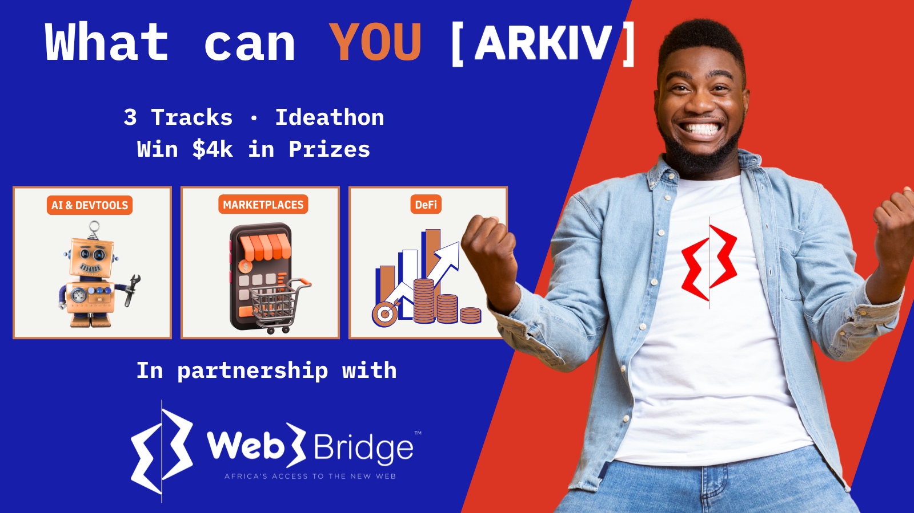

# What can YOU [ ARKIV ] ? — Ideathon

**An ideathon on the Web3 database. August 2026 · fully online · free to enter.**

Pitch what you'd build on [Arkiv](https://arkiv.network) — the queryable, tamper-proof Web3 database. **Ideas, not prototypes:** you design the concept and its Arkiv data model; you don't have to deploy anything. If you can describe the entities you'd write, the queries you'd run, and why the idea genuinely needs Arkiv — you can enter.

Three back-to-back challenges run across August — **AI & DevTools**, then **Marketplaces**, then **DeFi** — each accepting submissions only during its own window, alongside an open **Other** lane that runs all month. Every submission goes through the same form and is scored on the same rubric.

---

## Pick your challenge

| Challenge | Submission window | Host | What belongs here |
| :-------- | :---------------- | :--- | :---------------- |
| **1 · AI & DevTools** | Aug 3 – 11 | Santiago Zuluaga | Tools where your agent needs queryable, time-scoped, tamper-proof coordination state across runs, commits, tasks or repos |
| **2 · Marketplaces** | Aug 12 – 20 | Shantelle Awomoyi | Listings, quotes, bookings, bounties — anything with a lifecycle that should filter cleanly and expire itself |
| **3 · DeFi** | Aug 21 – 31 | Marcos Miranda | Queryable, time-scoped, tamper-proof market evidence and coordination state — kept off the execution hot path |
| **Other** | All month | Santiago Zuluaga (open lane) | Anything else that genuinely needs Arkiv's model: registries, provenance, governance, social graphs, game state |

Each numbered challenge is hosted **and** accepts its submissions during the same window: its host runs sessions and highlights while it is open, and entries to that challenge close when its window does. The open **Other** lane is the exception — it runs all month and closes with the event on **Aug 31, 23:59 UTC**. Full briefs with idea seeds per challenge: **[Ideation Guide](docs/ideation-guide.md)**.

---

## What a submission is

Your form answers **are** the submission — no repo, no deploy, no separate write-up. The form asks for:

- The idea: name, one-line pitch, the problem and who it's for, the first slice you'd build
- **The data model — where we score hardest:** the Arkiv entities and typed attributes you'd write, the queries you'd rely on, how expiry / extension / verifiable ownership become product features, why Arkiv beats a plain database, and what deliberately stays **off** Arkiv
- Optional supporting material: a mock, diagram, pseudocode or short video — they can clarify, but polish doesn't earn points

About 10 minutes if you've thought the idea through. **[Submit here →](https://tally.so/r/OD9eeY?ref=github-readme)**

---

## What's in it for you

- **$1,000 USDC per track** — every challenge and the open lane has its own pool: $500 for 1st place, $300 for 2nd, $200 for 3rd ($4,000 USDC across the four)
- The best ideas get showcased as reference concepts for builders working on Arkiv
- Feedback and support from the Arkiv team throughout the month — join the [Arkiv Discord](https://discord.gg/arkiv)
- No code required, no testnet required, no stack to fight — just the thinking

---

## Who this is for

- Developers, designers, founders, researchers — if you can reason about data and queries, you can enter
- Solo or team (max 5); one prize per winning team
- Fully online, worldwide, 18+
- Using AI assistants to sharpen your idea is allowed and encouraged — arm your agent with Arkiv context first: **[Agent Guide](docs/agent-guide.md)**

---

## Timeline

| Date | What |
| :--- | :--- |
| **Aug 3** | Submissions open — Challenge 1 and the open **Other** lane |
| **Aug 3 – 11** | Challenge 1 · **AI & DevTools** — closes **Aug 11, 23:59 UTC** |
| **Aug 12 – 20** | Challenge 2 · **Marketplaces** — closes **Aug 20, 23:59 UTC** |
| **Aug 21 – 31** | Challenge 3 · **DeFi** — closes **Aug 31, 23:59 UTC** |
| **All month** | Open **Other** lane — closes **Aug 31, 23:59 UTC** |
| **Week of Sept 1** | Judging, highlights & winners roll out (recap + winner announcements) |

*The Organizer reserves the right to adjust these dates. Changes will be communicated via Discord and official channels. Full terms: [RULES.md](RULES.md).*

---

## Prizes

**Each of the four tracks has its own $1,000 USDC prize pool — $500 for 1st place, $300 for 2nd, $200 for 3rd** ($4,000 USDC in total), decided by the judging team (the track host + guests) against the published [scoring rubric](docs/scoring-rubric.md). If a track does not receive three ideas that meet the judging criteria, the remaining prize money from that track may be redistributed to other tracks.

Strong ideas can also earn **non-monetary support**: mainnet credits / early access as Arkiv approaches mainnet, follow-on build incentives, and marketing amplification for the strongest ideas.

- Prizes are paid in USDC **on Ethereum mainnet** to the wallet address confirmed during KYC.
- **Prize winners complete KYC before payout** — every member of a winning team, individually. Details: [RULES Section 7](RULES.md#7-kyc--prize-disbursement).
- One prize per individual or team, regardless of how many entries they submit.

---

## Judges

The judging team is led by the track hosts — **Santiago Zuluaga** (AI & DevTools + Other), **Shantelle Awomoyi** (Marketplaces) and **Marcos Miranda** (DeFi) — who may bring in guest judges. Every submission is scored against the published **[scoring rubric](docs/scoring-rubric.md)**: 20 points for track alignment + 80 general points across Arkiv fit, data & query design, impact & usefulness, clarity & feasibility, and uniqueness.

---

## In partnership with Web3Bridge

**[Web3Bridge](https://www.web3bridgeafrica.com/)** — *Africa's access to the new web* — is running
this ideathon with us. They train blockchain developers across Africa and lower the barrier into
Web3. If you are coming through their community: everything in this repo applies to you unchanged —
the same rubric, the same per-track pools, the same windows. Bring the idea.

---

## Quick links

### Understand the ideathon

| What | Where |
| :--- | :---- |
| **Ideation Guide** | [docs/ideation-guide.md](docs/ideation-guide.md) — the 60-second Arkiv mental model, challenge briefs, idea seeds, what makes a strong pitch |
| **Official Rules** | [RULES.md](RULES.md) — terms, eligibility, prizes, KYC |
| **Scoring Rubric** | [docs/scoring-rubric.md](docs/scoring-rubric.md) — how we score, what we look for |
| **FAQ** | [FAQ.md](FAQ.md) — common questions answered |

### Arm your agent

| What | Where |
| :--- | :---- |
| **Agent Guide** | [docs/agent-guide.md](docs/agent-guide.md) — the Arkiv MCP + build-recipe skills, so your assistant designs with real Arkiv knowledge instead of guessing |
| **Arkiv Docs** | [docs.arkiv.network](https://docs.arkiv.network) |
| **TypeScript SDK** | [github.com/Arkiv-Network/arkiv-sdk-js](https://github.com/Arkiv-Network/arkiv-sdk-js) — optional, if you want to sketch your entity model in code |

### Submit & get help

| What | Where |
| :--- | :---- |
| **Submit your idea** | [tally.so/r/OD9eeY](https://tally.so/r/OD9eeY?ref=github-readme) |
| **Arkiv Discord** | [discord.gg/arkiv](https://discord.gg/arkiv) |
| **Event site** | [ideathon.arkiv.network](https://ideathon.arkiv.network) |
